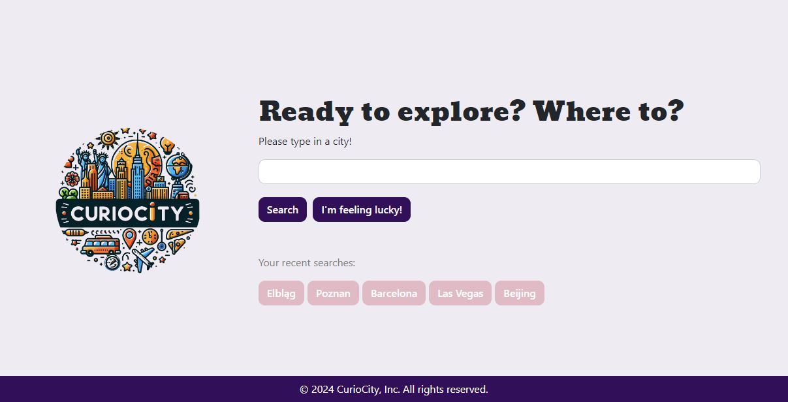
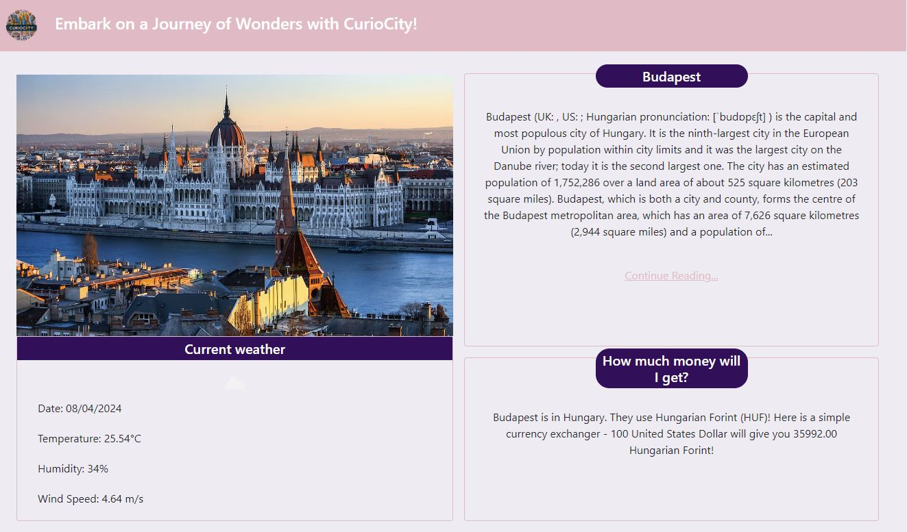
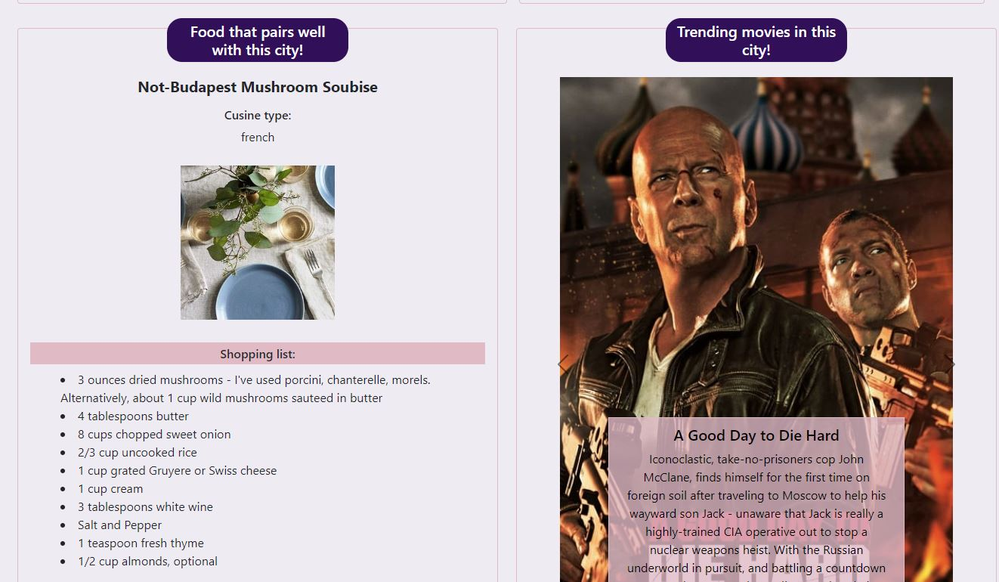

# CurioCity: Your Interactive City Exploration Companion

## Description

CurioCity is an innovative, user-friendly platform that enhances the urban exploration experience. Designed for both avid travelers and curious locals, it offers a comprehensive guide to cities worldwide. By inputting a city name, users receive an array of information: current weather, captivating images, city descriptions, trending movies, local cuisine insights, and a convenient currency converter. This holistic approach, powered by seven different server-side APIs, provides an immersive and informative exploration tool for city enthusiasts.

## Table of Contents

  - [Description](#description)
  - [Installation](#installation)
  - [Usage](#usage)
  - [Features](#features)
  - [Screenshot and links](#screenshot-and-links)
  - [Credits](#credits)
  - [Contributors](#contributors)
  - [Technologies Used](#technologies-used)

## Installation

To install and run this CurioCity:

1. Clone the repository from GitHub.

2. Replace API keys with your personal keys obtained from the respective API providers.

## Usage

1. Enter the name of a city in the search box.

2. Browse through the comprehensive data provided, including weather, images, city descriptions, videos, cuisine, and currency exchange rates.

3. Each search will be stored in your history for easy future reference.

## Features

**Current Weather Data:** Access up-to-date weather information for any searched city.

**City Images and Description:** Explore beautiful images and detailed descriptions of cities.

**Trending Movies:** Watch popular videos related to the selected city and country.

**Local Cuisine:** Discover the culinary delights that the city offers.

**Responsive and Interactive UI:** A user-friendly interface that responds to your every input.

## Screenshot and links

### Link to the working app

The [URL](https://curio-city.netlify.app/) of deployed application.

The application was deployed using Netlify.

## Credits

Special acknowledgments to:

- OpenWeatherMap, Edamam, TMBD, Wikipedia, Flickr, exchangerate-api and other API providers for data.
- Stack Overflow, MDN Web Docs, and the broader development community for guidance and support.
- Our Instructors, TAs and friends for help and understand where is a problem and how to solve it.

## Contributors

The success of CurioCity is attributed to the dedicated efforts of our talented team:

1. [Paulina Siwko](https://github.com/paulinasiwko)
2. [Nirmean Sawi](https://github.com/Nirmean)
4. [Tomasz Jasinski](https://github.com/TomixJasina)
5. [Michal Paleczny](https://github.com/MrKatrish)

## Technologies Used

- 
- 
-  
- 
- 
- 
- Day.js
- Multiple Server-Side APIs